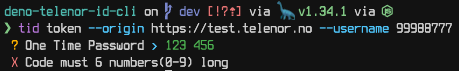
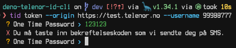
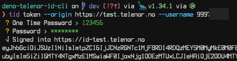
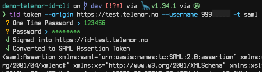
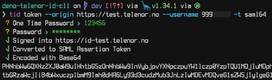

# Telenor-ID CLI

The Telenor ID CLI can be used to interact with Telenor ID from the comfort of
your terminal.

For donwload and installation information, check out the
[installation guide](./install.md).

## Getting the access token

You can use this CLI tool to sign into Telenor ID and retrieve an access token,
which can also be converted to SAML or SAML Base64-encoded.

For general usage information check out `tid token --help`.

> TLDR;
>
> **Note** that phone numbers must be in a compact form without +47, for
> example: `11122333`.
>
> Generating a JWT token in the test environment and copying it to the
> clipboard.
>
> ```sh
> tid token --clipboard  -o https://test.telenor.no -u 'phone-number' -c 'otp' -p 'password'
> ```
>
> Generating a SAML token in the test environment and copying it to the
> clipboard.
>
> ```sh
> tid token --clipboard -o https://test.telenor.no -u 'phone-number' -c 'otp' -p 'password' -t saml
> ```
>
> Generating a SAML Base64-encoded token in the test environment and copying it
> to the clipboard.
>
> ```sh
> tid token --clipboard -o https://test.telenor.no -u 'phone-number' -c 'otp' -p 'password' -t saml64
> ```

`tid token` is the command that is used to authenticate against Telenor ID.

**Usage information for `tid token`.**

```
  Usage:   tid token
  Version: 0.1.0    

  Description:

    Generate token

  Options:

    -h, --help               - Show this help.
    -o, --origin    <url>    - The origin endpoint                                  (required)
    -t, --type      <type>   - The type of token to be returned                     (Default: "jwt", Values: "jwt", "saml", "saml64")
    -s, --silent             - Silent output the token                              (Depends: --username, --code, --password)
    -u, --username  <phone>  - The phone number (XXXXXXXX)                          (required)
    -c, --code      <code>   - The OTP code
    -p, --password  <value>  - The account password
    --fail                   - Fail if the username, otp, or password is incorrect  (Depends: --username, --code, --password)
    -d, --debug              - Show full stack traces
    --clipboard              - Copy to clipboard
```

All `tid token` calls require two options, `--origin` (short `-o`) and
`--username` (short `-u`). The origin is which environment you want to sign
onto, for example: `https://test.telenor.no` or `https://telenor.no`. The
username option is the phone number you want to sign in with. Unlike on Telenor
ID, the username should not be formatted - If your phone number is
`+47 999 88 777`, you should proivde it as `99988777`.

With this information you can make your first authorization against Telenor ID.

```sh
tid token --origin https://test.telenor.no --username 99988777
```

The command will now prompt you for a one-time password sent to your number on
SMS. This must be provided in the following format: `XXXXXX`. It will give you
an error if you provide it in any other way.



If you type in an incorrect OTP you will get an error and be prompted another
time for the correct OTP. You can disable this by using `--fail`, it will fail
fast if any of the data provided is invalid, but with `--fail` you must also
provide the one-time password and password in the commandline parameters.



After providing a valid OTP you will be prompted for a pasword.



And there you! An access token!

## SAML and Base64-encoding

You can also get a SAML token by appending `-t saml` to the command.



If you also need this to be Base64-encoded you can change `-t saml` to
`-t saml64`.



## Copy to clipboard

Can't bother to copy the token manually? Append `--clipboard` to the command and
the command will try to copy the token to your clipboard.

> **Note** that this feature is currently only supported on MacOS.

## Usage in scripting

If you're like me .. lazy, you probably don't want to type a long command every
time you want to get a token.

If you're still reading, you are most likely comfortable in the terminal. With
some understanding of your shell environment you should be able to understand
the command's help information `SHOW_HINTS=1 tid token -h`. You should be able
to tailor a shell function or alias to your needs.

Here's an example of getting the different token types for a phone number:

```sh
alias 9998877-jwt="tid token --fail --clipboard -s -o https://test.telenor.no -u 99988777 -c 123123 -p super-secret-password"
alias 9998877-saml="tid token --fail --clipboard -s -o https://test.telenor.no -u 99988777 -c 123123 -p super-secret-password -t saml"
alias 9998877-saml64="tid token --fail --clipboard -s -o https://test.telenor.no -u 99988777 -c 123123 -p super-secret-password -t saml64"
```

# Need more help or have ideas?

Feel free to
[join the channel on Slack](https://thedoozers.slack.com/archives/C05AML7795L).
